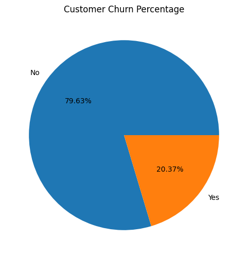
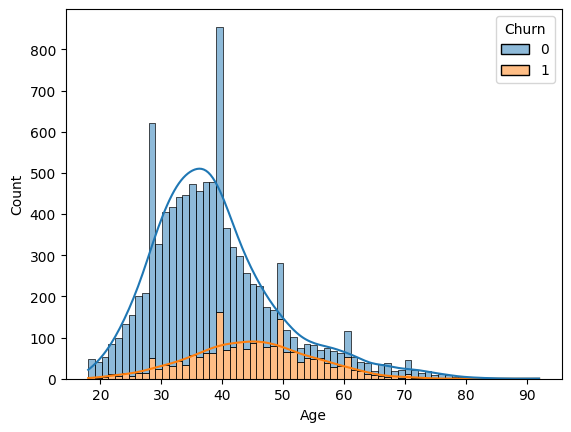
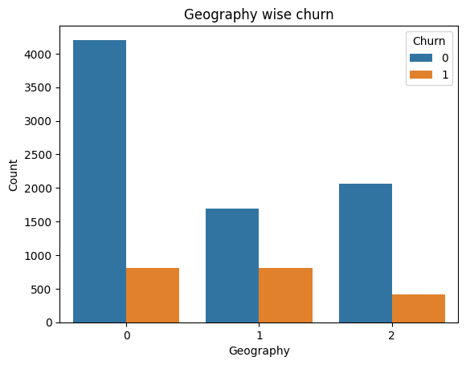
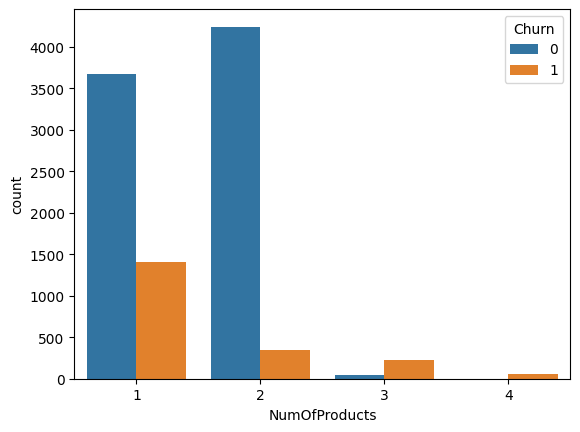
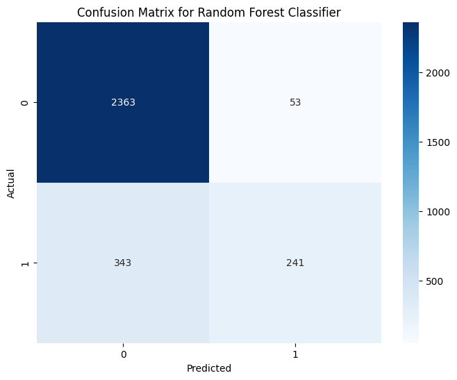

<p align="center">
  
</p>

# Bank Customer Churn Prediction

Banks lose money every time a customer closes their account, and it's a lot cheaper to keep someone than to find a replacement. So the question I wanted to answer here is: given what a bank knows about a customer (age, country, balance, how many products they hold, whether they're active), can we tell who is about to leave?

I used a Kaggle dataset of 10,000 bank customers, looked at what separates the ones who left from the ones who stayed, and trained two models: a decision tree and a random forest. The random forest came out slightly ahead at 86.8% accuracy on the test set. That sounds good, but there's a catch that I explain below: it only catches about 4 in 10 of the customers who actually leave.

The longer write-up is in [REPORT.pdf](REPORT.pdf) and all of the code is in `Final_churn_prediction.ipynb`.

## Dataset

Source: [Churn for Bank Customers on Kaggle](https://www.kaggle.com/datasets/mathchi/churn-for-bank-customers). It has 10,000 rows and 14 columns. I dropped `RowNumber`, `CustomerId` and `Surname` because they don't say anything about behaviour, and renamed the target column `Exited` to `Churn`.

| Column | What it is |
| --- | --- |
| CreditScore | Customer's credit score |
| Geography | France, Germany or Spain |
| Gender | Male or female |
| Age | Age in years |
| Tenure | Years with the bank |
| Balance | Account balance |
| NumOfProducts | How many bank products they use (1 to 4) |
| HasCrCard | 1 if they have a credit card with the bank |
| IsActiveMember | 1 if they're an active member |
| EstimatedSalary | Estimated salary in dollars |
| Churn | 1 if the customer left, 0 if they stayed (the target) |

About 20.4% of the customers in the data left, so the classes are imbalanced. That matters for how you read the results.

<p align="center">
  
</p>

## What I found in the data

- **Age** is the clearest signal. Customers in their 40s and 50s leave much more often than people in their 20s.
- **Geography**: Germany has fewer customers than France but a similar number of people leaving, so its churn rate is roughly double the others.
- **Number of products**: the large majority of people with 3 or 4 products leave. Two products is the sweet spot, with a low churn rate.
- **Active members** leave less often than inactive ones.
- **Credit score and estimated salary** show no real pattern.

<p align="center">
  
  
  
</p>

(In the geography chart 0 = France, 1 = Germany, 2 = Spain, because I label-encoded it before the model step.)

## How it works

1. Drop the ID-type columns, check for nulls and duplicates.
2. Explore each feature against churn.
3. Label-encode `Geography` and `Gender`, standardise `CreditScore`, `Balance` and `EstimatedSalary`.
4. Split 70/30 (`random_state=42`), which gives 3,000 test customers.
5. Tune a `DecisionTreeClassifier` and a `RandomForestClassifier` with `GridSearchCV`, 5-fold, scored on ROC AUC.
6. Compare them on the test set.

## Results

| | Decision tree | Random forest |
| --- | --- | --- |
| Best settings | gini, depth 6, min leaf 10 | entropy, depth 10, min leaf 8 |
| Train accuracy | 0.858 | 0.877 |
| Test accuracy | 0.861 | 0.868 |
| Precision (churners) | 0.80 | 0.82 |
| Recall (churners) | 0.39 | 0.41 |
| F1 (churners) | 0.52 | 0.55 |

The forest wins, but not by much. Here's its confusion matrix:

<p align="center">
  
</p>

Out of 584 customers who really left, the forest caught 241 and missed 343. When it says someone will leave it's right about 82% of the time, but it doesn't say it often enough.

For context, a model that predicts "everyone stays" would already score about 80.5% accuracy on this test set (2,416 of 3,000). So 86.8% is a modest gain, and recall on the churn class is the number I'd want to improve.

<details>
<summary><b>Running it</b> (click to expand)</summary>

You need Python 3.9+ and:

```
pip install pandas numpy matplotlib seaborn scikit-learn jupyter
```

The notebook was written in Google Colab and loads the data from Google Drive:

```python
df = pd.read_csv('./drive/MyDrive/churn.csv')
```

To run it locally, delete the `drive.mount` cell and change the path to wherever you saved the file, for example `pd.read_csv('churn.csv')`. The original Kaggle file is called `Churn_Modelling.csv`, so either rename it or change the name in the notebook.

A couple of cells use `sns.distplot`, which is deprecated and prints a warning in recent seaborn versions. It still runs.

</details>

## Things I'd fix or try next

- The notebook prints R² and mean absolute error for the classifiers. Those don't mean much for a yes/no target, so ignore them. Precision, recall, F1 and ROC AUC are the ones to look at.
- I fitted the `StandardScaler` on the full dataset before splitting, which leaks a tiny bit of test information into training. It should be fitted on the training set only. Tree-based models don't need scaling anyway.
- The two `distplot` charts of actual vs predicted values on a 0/1 target don't tell you anything. A ROC curve or a precision-recall curve would be more useful.
- No handling of class imbalance. Using `class_weight='balanced'`, or lowering the decision threshold below 0.5, should raise recall.
- Try gradient boosting (XGBoost / LightGBM) and one-hot encode `Geography`.
- My conclusion in the notebook lists `HasCrCard` and `Tenure` as churn factors. Looking back at the correlations, both are basically zero, so I wouldn't lean on them. More card holders leave simply because most customers have a card.

## Files

```
.
├── assets/                          # banner and plots used in this README
├── Final_churn_prediction.ipynb     # the whole analysis
├── churn.csv                        # dataset (from Kaggle)
├── REPORT.pdf                       # longer write-up
└── README.md
```

## Author

[Your name]
